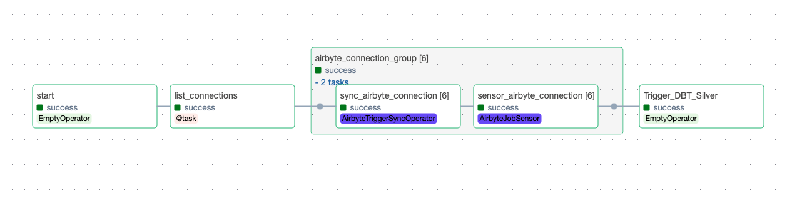

# Weather Data Pipeline (New York Rain Analytics)

[](https://github.com/CaioHAndradeLima/retail-data-pipeline/actions/workflows/ci.yml)

> Build a production-style ELT platform that ingests NOAA weather observations for New York stations and publishes rain analytics in Snowflake, so you can track rainy days per month, power forecasting models, and detect when rain starts in near real time.

### No UI Clicks ever.

<b>Everything</b> is configured through code: setup, infrastructure, ingestion, orchestration, and transformations.

- **NOAA API** (source weather observations)
- **Postgres** (raw operational landing)
- **Airbyte** (ingestion from Postgres to Snowflake Bronze)
- **Airflow** (orchestration)
- **dbt** (Silver and Gold transformations)
- **Snowflake** (analytics warehouse)

## You don’t scale pipelines. You scale patterns

This project is organized so one setup flow can bootstrap the full local stack and Snowflake environment.

```yml
setup.from-scratch execution

Check local dependencies
   │
   ▼
Collect Snowflake credentials and create .env
   │
   ▼
Create Snowflake roles and grants
   │
   ▼
Provision Snowflake warehouse/database/schemas via Terraform
   │
   ▼
Generate dbt profile
   │
   ▼
Ready to run Airbyte + Postgres + Airflow locally
```

---

## Airflow Orchestration

### Data-Driven Orchestration through Dynamic Airbyte Ingestion

**Conceptual flow:**

```yml
    DAG started
        │
        ▼
recover airbyte connections
  tables/columns to sync
        │
        ▼
[ trigger_connection_1 ]──sensor results──┐
[ trigger_connection_2 ]──sensor results──┼──► trigger_dbt_silver
[ trigger_connection_3 ]──sensor results──┘            │
                                                       ▼
                                                 trigger_dbt_gold
```

---

Airflow owns **execution**, not configuration.

```python
with DAG(
    dag_id="postgres_to_snowflake_bronze",
    ...
) as dag:
    # Discover connections from Airbyte API
    connections = list_connections()

    # Trigger sync from Postgres -> Snowflake Bronze
    sync = AirbyteTriggerSyncOperator(
        task_id="sync_airbyte_connection",
        pool="airbyte_sequential",
        ...
    )

    # Wait for sync completion
    sensor = AirbyteJobSensor(
        task_id="sensor_airbyte_connection",
        airbyte_job_id=sync.output,
        pool="airbyte_sequential",
        ...
    )

    # Trigger Silver
    end = EmptyOperator(
        task_id="Trigger_DBT_Silver",
        outlets=[WEATHER_BRONZE],
    )
```

### Airflow Graph



## Configuration-driven Philosophy

> **Inform Snowflake credentials once. Run setup and infra from Make commands.**

- Airbyte source/destination/connections created programmatically
- Airflow connections and pools created programmatically
- No manual Snowflake object creation
- No manual Airflow core configuration
- No per-table DAG creation
- Medallion flow (Bronze/Silver/Gold) with clear ownership

The system is **data-driven**: adding input tables is configuration, not new orchestration code.

Core commands:

```bash
# show all commands
make help

# full setup from zero (deps + .env + snowflake + dbt profile)
make setup.from-scratch

# full infra lifecycle from zero (stop then start all local infra)
make infra.from-scratch

# start everything (airbyte + postgres + airflow)
make infra.up

# stop everything
make infra.down
```

Run entire infra with one command:

```bash
make infra.up
```

---

## High-Level Architecture

```yml
NOAA API (KJFK, KLGA, KTEB) ─────┐
   │                             │
   │ observations                │
   ▼                             │
Postgres (weather schema)        │
   │                             │
   │ incremental / CDC-style load│
   ▼                             │
Airbyte                          │
   │                             │
   │ sync to Snowflake Bronze    │
   ▼                             ┼──► Airflow Orchestrator
Snowflake                        │
   ├── BRONZE                    │
   ├── SILVER                    │
   └── GOLD                      │
   │                             │
   ▼                             │
BI / Analytics  ◄────────────────┘
```

---

## Continuous integration Flow

[](https://github.com/CaioHAndradeLima/retail-data-pipeline/actions/workflows/ci.yml)

```bash
Steps

Lint Check  ────────────┐
   ├── Ruff             │
   │                    │
   ▼                    │
Formatting Check        │
   ├── Black            │
   │                    │
   ▼                    │
Validate DAG imports    │
   ├── Airflow          ┼──► GitHub Actions
   │                    │
   ▼                    │
Validate dbt            │
   ├── SILVER           │
   └── GOLD             │
   │                    │
   ▼                    │
Analytics Ready ────────┘
```

---

## Ingestion Details

- NOAA observations are fetched for New York area stations (`KJFK`, `KLGA`, `KTEB`)
- Raw observations are written into local Postgres (`weather.observations`)
- Airbyte syncs Postgres tables to Snowflake Bronze
- dbt Silver standardizes and cleans observations
- dbt Gold builds rain-focused analytical marts

---

## Snowflake via Terraform

Snowflake resources are provisioned and managed by Terraform, including:

- Warehouse configuration
- Role and grants management
- Database/schema setup for Bronze/Silver/Gold

```yml
infra/remote/snowflake/
├── setup/
│   ├── generate_terraform_user.sh
│   ├── install_local_cli.sh
│   └── roles.sql
│
├── warehouse.tf
├── grants.tf
├── main.tf
├── provider.tf
├── variables.tf
└── versions.tf
```

---

## Local Infra

```yml
infra/local
├── postgres/
├── airbyte/
├── airflow/
├── start_containers.sh
└── stop_containers.sh
```

### Postgres configuration-driven flow

```yml
└── init/
    ├── 01_wal_level_setup.sql
    ├── 02_init_retail_oltp.sql
    ├── 03_cdc.sql
    └── 05_airbyte_user.sql
```

### Airbyte configuration-driven flow

```yml
start_airbyte.sh             ──────────────┐
   ├── Start Airbyte local stack           │
   │                                       │
   ▼                                       │
setup_credentials.sh                       │
setup_postgres_source.sh                   │
setup_snowflake_destination.sh             │
generate_ingestion_json.sh                 │
create_connections.sh                      │
   │                                       │
   ▼                                       │
Start Airflow  ◄───────────────────────────┘
```

### Airflow orchestrator

```yml
Container starts  ──────────────┐
   │                            │
   ▼                            │
Load DAGs                       │
   ├── Bronze ingestion         │
   ├── Silver transformation    │
   └── Gold transformation      │
   ▼                            │
NY weather rain marts ready ◄───┘
```

## Weather Business Questions

The Gold models are built to answer rain analytics questions for New York:

- `weather_daily_rain`: Did it rain on a given day per station? How much precipitation accumulated?
- `weather_monthly_precipitation`: What is total monthly precipitation per station?
- `weather_rainy_days_monthly`: How many rainy days occurred per month across the region?

Typical questions this project answers:

- How many rainy days happened in New York each month?
- Which station had the highest monthly precipitation?
- Is monthly precipitation increasing or decreasing over time?
- How many observation days were captured versus rainy days?

## dbt Strategy

dbt is executed via **CLI orchestration**, intentionally simple:

| Approach         | Reason                     |
|------------------|----------------------------|
| CLI-based dbt    | Low complexity, easy CI/CD |
| No Cosmos        | Avoid DAG explosion        |
| Layer-level runs | Clear failure domains      |

---
